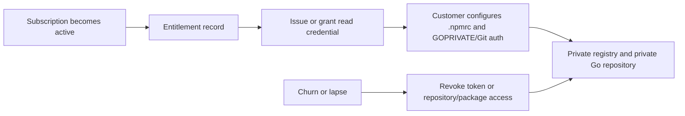

# Private-package distribution for the subscription model

This spike defines a delivery path for Alloy's paid subscription packages. It decides how a paying customer can resolve TypeScript and Go dependencies with standard package tooling, how access follows an entitlement, and what must change from today's release artifacts and clone-based workflow. It does not design billing, a customer portal, or the entitlement service.

**Status: spike / draft for owner review**

> **TL;DR — recommend GitHub Packages for TypeScript and a private GitHub distribution repository for Go.** Rename the invalid TypeScript package names to a registry-valid `@alloy/sdk-<name>` form, publish them to GitHub Packages from the TypeScript release workflow, and distribute Go modules from a separate private repository accessed with `GOPRIVATE` and authenticated Git. Map active subscriptions to repository/package access and revoke that access when entitlement ends.

## 1. Requirements

The distribution path must serve paid customers without creating a public registry or a public `alloy.dev` registry domain.

| Requirement | Why it matters |
| --- | --- |
| Normal TypeScript installation | A customer must be able to run `pnpm add @alloy/...` against an authenticated registry, rather than download and hand-install a release tarball. |
| Normal Go installation | A customer must be able to run `go get <private-module>@<version>` with standard Go environment settings, rather than clone Alloy and maintain a local `go.work`. |
| Semver releases | The five TypeScript packages and the Go module family need explicit, reproducible versions that customers can pin, upgrade, and roll back. |
| Subscription-gated reads | Only an active subscriber may receive package metadata and package/module contents. |
| No public registry | Package endpoints and module source must remain private; this plan introduces no public Alloy registry hostname. |
| CI-publishable releases | A release tag or dispatch must be able to create the customer-visible version without a developer's workstation or manual tarball handoff. |
| Revocable access | When entitlement lapses, newly authenticated dependency reads must stop after the chosen access-revocation window. Existing local caches cannot be recalled. |
| Low operating burden | The first implementation should minimize services Alloy has to run and secure. |
| Compatibility can change before 1.0 | Package and module import paths may change if that produces a viable distribution contract; migrations must be explicit. |

## 2. Current state

### TypeScript

The five TypeScript packages live in `sdk/`: `sdk/console`, `sdk/money`, `sdk/navigator-routes`, `sdk/tempo`, and `sdk/workflow`. Their declared names are `@alloy/sdk/console`, `@alloy/sdk/money`, `@alloy/sdk/navigator-routes`, `@alloy/sdk/tempo`, and `@alloy/sdk/workflow`; each is `private`, is currently version `0.1.0`, and uses `workspace:*` for internal dependencies. The workspace uses pnpm 10.33.0 and Vite+ (`vp`), with workspace membership defined by `pnpm-workspace.yaml`.

`.npmrc` configures `engine-strict=true`, `auto-install-peers=true`, and `store-dir=infra/.cache/pnpm/store`. It has no registry URL, scope mapping, or authentication configuration.

The current TypeScript release path is [`.github/workflows/release-ts.yml`](../../.github/workflows/release-ts.yml). It runs on `workflow_dispatch` or a `ts/v*` tag, invokes [`infra/scripts/tasks/check-pack-ts-packages.sh`](../../infra/scripts/tasks/check-pack-ts-packages.sh), and creates a GitHub Release with the resulting `.tgz` files attached. The script checks that each package version matches the release version, runs typecheck/test/build, and runs `pnpm --filter <pkg> pack` into an artifact directory. No workflow runs `npm publish` or otherwise writes to an npm-compatible registry. Customers therefore receive tarballs, not a dependency they can add normally.

### Go

The primary Go module is `github.com/oullin/alloy/pkg/hub` in [`pkg/hub/go.mod`](../../pkg/hub/go.mod), using Go 1.26.5. Two nested modules also use Go 1.26.5: `github.com/oullin/alloy/pkg/hub/auth/passkeys` in [`pkg/hub/auth/passkeys/go.mod`](../../pkg/hub/auth/passkeys/go.mod), and `github.com/oullin/alloy/pkg/hub/queue/drivers/sqs` in [`pkg/hub/queue/drivers/sqs/go.mod`](../../pkg/hub/queue/drivers/sqs/go.mod). There is no root `go.work`; internal development relies on [`pkg/hub/go.work.example`](../../pkg/hub/go.work.example) and the committed [`pkg/hub/go.work.sum`](../../pkg/hub/go.work.sum).

[`web/docs/getting-started.md`](../../web/docs/getting-started.md) documents the actual consumer procedure: clone `git@github.com:oullin/alloy.git`, create a workspace in the customer's application with `go work init .`, then add `../alloy/pkg/hub` with `go work use`. This is explicitly necessary because the module path is not publicly served. The per-package documents in `web/docs/packages/*.md` instead show `go get github.com/oullin/alloy/pkg/hub/<pkg>@latest`; that conflicts with the documented clone-based condition because the module is not fetchable for customers today.

The Go release path is [`.github/workflows/release-go.yml`](../../.github/workflows/release-go.yml). It runs Go tests and creates a GitHub Release with generated notes on `workflow_dispatch` or `go/v*` tags. It publishes neither module artifacts nor a module proxy. A single `go/v*` tag also does not cleanly version the nested modules: Go module versions derive from Git tags, and each nested module needs a tag prefix such as `pkg/hub/auth/passkeys/vX.Y.Z`.

`CONTRIBUTING.md` has minor convention drift: it still describes TypeScript packages under `packages/<name>` named `@alloy/*`, rather than the actual `sdk/<name>` layout and `@alloy/sdk/*` declarations.

## 3. TypeScript registry options

All options require customer-side authentication in an `.npmrc` equivalent to the following, with the hostname and scope mapping set for the selected registry:

```ini
@alloy:registry=https://registry.example.invalid/
//registry.example.invalid/:_authToken=${ALLOY_NPM_TOKEN}
```

The token must be read-only for customers. A separate CI credential must be allowed to publish but must never be placed in customer documentation or customer configuration.

| Option | Customer authentication and entitlement mapping | CI publishing | Operations and fit |
| --- | --- | --- | --- |
| GitHub Packages npm registry | Customer config maps the chosen scope to GitHub Packages and supplies a token. Access can be tied to GitHub organization/repository/package read permission granted only to active subscribers. | Add an authenticated `npm publish` step after the existing pack/check gate in `release-ts.yml`. | Low incremental operations because source and releases already use GitHub. Confirm current package-permission inheritance, external-collaborator behavior, token types, audit needs, and pricing before deciding. |
| Self-hosted Verdaccio | Customer `.npmrc` targets Alloy's Verdaccio endpoint with a registry token. An entitlement system creates, enables, and disables the token or the account. | CI publishes to the private endpoint with a publisher credential. | Full control, but Alloy owns availability, storage, backups, upgrades, monitoring, TLS, and abuse controls. Appropriate only if GitHub access cannot express the customer model. |
| Commercial private registry (npm private, Cloudsmith, or similar) | Customer receives a vendor token in `.npmrc`; billing entitlement maps to the vendor's reader/team/project permission. | CI uses a vendor publisher credential and registry endpoint. | Delegates registry operations and may offer subscription-oriented access controls. Pricing, storage/transfer limits, customer identity support, token revocation, retention, and SLA are **verify before deciding**. |

### The current names cannot be published as npm packages

npm scoped package names have one slash: `@scope/name`. The current declarations have a second path slash, for example `@alloy/sdk/tempo`, so a real npm-compatible publish will likely require a rename. This is not a registry configuration detail; it is a migration decision.

Two viable registry-valid shapes are `@alloy/sdk-tempo` and `@alloy-sdk/tempo`. This document recommends `@alloy/sdk-<name>` because it retains the `@alloy` scope and changes only the package-name segment. The release process must also inspect the packed manifests and ensure former `workspace:*` dependencies become concrete, resolvable published versions before a customer installs them.

GitHub Packages is the leading TypeScript choice because its authorization can follow GitHub access to the private package or its associated repository. It does not remove the need for an entitlement process: subscription state must grant and revoke that GitHub access, or grant and revoke a credential that has the corresponding read permission.

## 4. Go module options

Go modules require a module source/proxy path; an npm registry cannot serve them. A customer configuration will include private-module settings. For a Git-hosted private module, the shape is:

```sh
go env -w GOPRIVATE=github.com/oullin/alloy-distribution
# GOPRIVATE is the default source for GONOPROXY and GONOSUMDB; set them
# explicitly only if you need a pattern different from GOPRIVATE.
go env -w GONOPROXY=github.com/oullin/alloy-distribution
go env -w GONOSUMDB=github.com/oullin/alloy-distribution
```

The exact patterns must cover all private module paths, and authenticated Git must be available through SSH or HTTPS with a customer credential. For a proxy, `GOPROXY` would point to the private proxy while `GOPRIVATE`, `GONOPROXY`, and `GONOSUMDB` are set according to the chosen proxy's documented model.

| Option | Customer installation and entitlement mapping | Versioning and nested modules | Operations and fit |
| --- | --- | --- | --- |
| Private module proxy (self-hosted Athens or commercial proxy) | Customer sets `GOPROXY` and receives a proxy token; subscription state enables or disables that token. `GOPRIVATE`/`GONOPROXY`/`GONOSUMDB` protect private module lookups from public services where appropriate. | Proxy serves Git-derived versions. Tag `pkg/hub/vX.Y.Z` for the primary module and `pkg/hub/auth/passkeys/vX.Y.Z` and `pkg/hub/queue/drivers/sqs/vX.Y.Z` for nested modules. | Provides a dedicated delivery surface and caching, but Alloy operates a proxy or buys one. Proxy feature set, retention, auth, and pricing are **verify before deciding**. |
| `GOPRIVATE` plus authenticated Git to a private distribution repository | Customer sets `GOPRIVATE` and fetches modules with `go get` over SSH or HTTPS token. Subscription state grants/revokes repository read access or an equivalent narrowly scoped credential. | The repository must contain the modules under paths that match their `module` declarations. Tags follow each module directory prefix: `pkg/hub/vX.Y.Z`, `pkg/hub/auth/passkeys/vX.Y.Z`, and `pkg/hub/queue/drivers/sqs/vX.Y.Z`. | Lowest operations burden and closest to the current clone-based flow. Go source is delivered through the private repository, so the owner must accept that as the product's Go delivery model. |
| Continue release tarballs and local `go.work` | Customer downloads/clones artifacts and wires local paths. Subscription control is whatever protects the release or clone source. | No normal remote module version resolution; tag discipline remains incomplete for nested modules. | Status quo. It fails the normal `go get` requirement and makes upgrades customer-managed. |

The distribution-repository option changes the public module identity if it is separate from `github.com/oullin/alloy`. For example, if the private distribution repository is `github.com/oullin/alloy-distribution`, the primary module declaration and customer command become `github.com/oullin/alloy-distribution/pkg/hub` and `go get github.com/oullin/alloy-distribution/pkg/hub@vX.Y.Z`; imports change with it. Pre-1.0 permits this break, but the change must be intentional. Keeping the existing module path instead would require subscribers to read the existing `github.com/oullin/alloy` repository.

## 5. Entitlement / token model (sketch)

This is a boundary sketch, not a billing or credential-service design. The billing system records subscription state. A credential store holds the resulting registry token, Git credential/access grant, or proxy token and associates it with the customer and entitlement. A provisioning worker grants the smallest read access needed when payment activates; a revocation worker disables that access when the subscription lapses or is cancelled. Release CI owns a distinct publisher credential.



The follow-up build must define token ownership, expiration/rotation, self-service recovery, audit events, support access, least-privilege permissions, and the delay between a billing event and revocation. It must also define what happens to already downloaded tarballs, Go module caches, and lockfiles; revocation controls future access, not copies already received.

## 6. Minimal POC

**Status: NOT-YET-RUN.** Execute this only in a throwaway checkout and temporary directories. The POC proves packaging and a local private-registry install; it must never publish to GitHub Packages, a customer channel, or any real registry, and it must never create real customer credentials.

First, establish the current packaging boundary for one package. This command uses the actual current package name and may expose the name-validation issue described above:

```sh
mkdir -p /tmp/alloy-private-dist-poc
pnpm --filter '@alloy/sdk/tempo' pack --pack-destination /tmp/alloy-private-dist-poc
cd sdk/tempo
npm publish --dry-run
```

Record the packed manifest and the dry-run result. Do not treat a successful tarball pack as proof that the current name can be published to an npm registry. The POC passes this stage only after the registry-valid renamed package has a packed manifest with installable external dependency ranges.

After the name migration, run an isolated local-registry round trip with the renamed Tempo package. `npx verdaccio` here is a local test harness, not the proposed production service:

```sh
npx verdaccio --listen 127.0.0.1:4873

# In a second terminal, use a throwaway npm user and only the local endpoint.
npm adduser --registry http://127.0.0.1:4873
cd sdk/tempo
npm publish --registry http://127.0.0.1:4873

mkdir -p /tmp/alloy-private-dist-consumer
cd /tmp/alloy-private-dist-consumer
pnpm init
pnpm add @alloy/sdk-tempo --registry http://127.0.0.1:4873
```

Expected output, if shown in POC notes, is illustrative only: the consumer lockfile resolves the renamed Tempo package from `127.0.0.1:4873`, and a simple import succeeds. Stop immediately if any command targets a non-local registry, uses a non-throwaway credential, or could create a customer-visible release.

## 7. Recommendation

Adopt a two-surface delivery model:

1. **TypeScript: GitHub Packages npm registry.** Rename the five packages to `@alloy/sdk-console`, `@alloy/sdk-money`, `@alloy/sdk-navigator-routes`, `@alloy/sdk-tempo`, and `@alloy/sdk-workflow`. Publish each version from `release-ts.yml` after the existing checks and pack verification. Give active subscribers read access through GitHub package/repository permissions or a credential model that carries only that access. Customers configure the scoped GitHub Packages registry and a read token in `.npmrc`.
2. **Go: authenticated Git with `GOPRIVATE` from a private distribution repository.** Create a private `github.com/oullin/alloy-distribution` repository containing the supported Go module family, change its module declarations/imports to that repository path, and release the primary and nested modules with their directory-prefixed tags. Give active subscribers read access to this repository through managed GitHub membership or narrowly scoped SSH/HTTPS credentials. Customers set `GOPRIVATE` (which also defaults `GONOPROXY`/`GONOSUMDB`) and run `go get` against the new private module paths.

This recommendation uses existing GitHub delivery and access controls rather than operating a registry or proxy on day one. It provides normal dependency commands, supports revocation of future reads, and keeps both delivery surfaces private. It also makes the unavoidable identity migrations explicit while Alloy remains pre-1.0.

The runner-up is a commercial private registry plus commercial Go proxy. It may reduce custom entitlement automation or add enterprise controls, but it adds a vendor decision before evidence shows GitHub access cannot satisfy the customer model. Evaluate it later if customers require organization-independent credentials, richer audit/SLA commitments, or a unified package portal. Pricing and feature claims are **verify before deciding**.

## 8. Migration steps

1. Owner approves the customer-access model: subscribers receive managed GitHub access, managed credentials, or a combination. Confirm that this satisfies the commercial and source-access expectations for Go.
2. Rename the five TypeScript packages to the chosen registry-valid names, starting with `@alloy/sdk-<name>`. Update all workspace imports, filters, tests, scripts, and package documentation. Preserve no compatibility aliases unless the owner explicitly asks for them.
3. Decide one release-version policy for the five TypeScript packages. Update internal dependency versions from `workspace:*` to published semver ranges during release, and make the release gate fail if packed manifests cannot be installed by an external consumer.
4. Configure the private GitHub Packages scope/package association and CI publisher credential. Before enabling production publishing, verify package visibility, customer-read authorization, token types, revocation behavior, and audit requirements against current provider documentation.
5. Extend `release-ts.yml` after `check-pack-ts-packages.sh` to publish the validated tarballs and verify a clean authenticated install of each released package. Retain GitHub Release attachments only if they remain useful as an audit artifact; they are not the customer installation channel.
6. Create the private Go distribution repository and define its sync/release ownership. Move or mirror only the supported Go module family into the module paths customers will fetch.
7. Change `go.mod` module declarations and Go imports to the private distribution-repository path. Publish the initial primary-module tag and the two nested-module tags using `pkg/hub/vX.Y.Z`, `pkg/hub/auth/passkeys/vX.Y.Z`, and `pkg/hub/queue/drivers/sqs/vX.Y.Z`.
8. Add Go release automation that validates the supported module family, creates the required tags, and verifies a clean external `go get` using only the documented private Git configuration.
9. Build the entitlement-to-access integration: activate a customer read grant on subscription, store only the necessary credential/access mapping, and revoke it on lapse. Keep publisher credentials separate from customer credentials.
10. Replace clone/`go.work` consumer instructions in `web/docs/getting-started.md`, reconcile the per-package `go get` examples, add `.npmrc` setup to TypeScript documentation, and correct the stale `CONTRIBUTING.md` TypeScript package location/name guidance.
11. Run a controlled internal beta with a non-owner customer account. Test install, version pinning, upgrade, revoked access, and the two nested Go modules before announcing availability.

## 9. Open questions for the owner

1. Is access sold per package, as a TypeScript/Go bundle, or as a single Alloy subscription?
2. Will each customer use managed GitHub organization/repository membership, customer-owned tokens, or credentials issued by Alloy?
3. Is exposing the supported Go source through a private distribution repository acceptable, or does the product require a proxy-based model with a different source-access boundary?
4. Approve `@alloy/sdk-<name>` as the TypeScript rename, or choose `@alloy-sdk/<name>` instead?
5. Should the Go distribution repository preserve the existing `github.com/oullin/alloy` module identity by granting access to that repository, or adopt the clean separate-repository identity and breaking import-path migration?
6. Do all five TypeScript packages release in lockstep, and must their version match the Go release version?
7. What billing system is authoritative, and what event represents activation, payment failure, grace period, cancellation, and reinstatement?
8. What customer count, access-review, audit, uptime, and support requirements would justify self-hosting or buying a registry/proxy instead of the GitHub-first recommendation?

## 10. Follow-up implementation plans

1. **TypeScript package-rename plan:** rename the five invalid package names, update imports/workspace filters/docs, and prove external packed-manifest resolution.
2. **TypeScript publish-pipeline plan:** configure GitHub Packages, add authenticated publish/install verification to `release-ts.yml`, and define release failure/retry behavior.
3. **Entitlement and credential plan:** connect billing state to GitHub package/repository read access, credential issuance, rotation, revocation, and audit events.
4. **Go distribution-repository plan:** create the private repository, select synchronization ownership, migrate module/import paths, and define the primary/nested tag pipeline.
5. **Go consumer-verification plan:** automate clean `GOPRIVATE` authenticated-Git `go get` tests for `pkg/hub`, passkeys, and the SQS driver.
6. **Customer documentation plan:** replace tarball/clone-local-workspace guidance with scoped `.npmrc`, Git authentication, `GOPRIVATE`, supported package/module names, upgrades, and revocation expectations.
